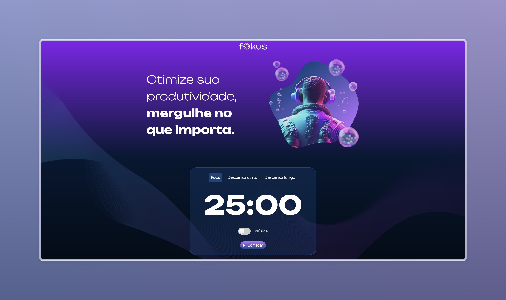
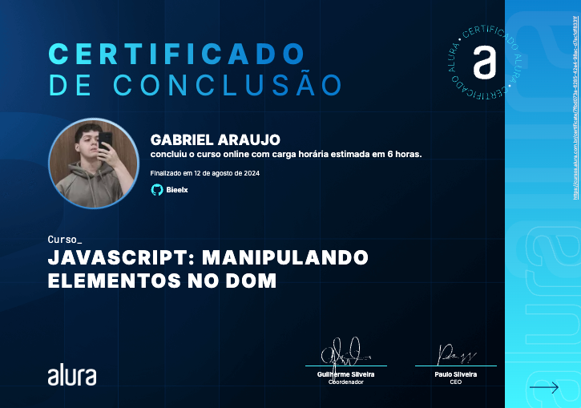

<h2 align = "center"> Fokus <h2> 
 By Bieelx 
 </h2>

Este repositório contém o código do projeto Fokus que foi criado com ajuda do curso da alura: JavaScript: manipulando elementos no DOM 

## 🚀 Tecnologias

Esse projeto foi desenvolvido com as seguintes tecnologias:
- HTML
- JavaScript
- CSS
- Figma

## 💻 Projeto

Este projeto foi desenvolvido com base no curso "JavaScript manipulando elementos no DOM" da Alura. Durante o desenvolvimento, aprendi a manipular diversos elementos no DOM, como a inserção de áudios e a troca de imagens com base na interação do usuário, por exemplo, ao apertar um botão.

Utilizei HTML, JavaScript, e CSS para estruturar e estilizar o projeto, além do Figma para criar o design. Através desse projeto, obtive um entendimento profundo de como o DOM funciona no JavaScript, aplicando técnicas práticas para tornar a página mais interativa e dinâmica.

